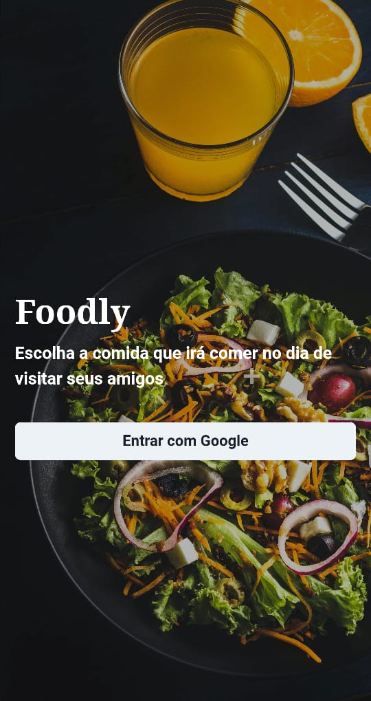

  

---
[See live](https://foodly.clecioalmeida.com.br)

## 👨🏽‍💻 About the project
I love having my friends over and preparing good food, so I decided to do this project, so that people can choose their dishes and schedule a visit to my house.
This project still in progress but will be ready soon.

[Figma Prototype](https://www.figma.com/proto/QShZZBhj3zRjDqBLigaudx/Foodly?page-id=0%3A1&node-id=2%3A3&viewport=441%2C348%2C0.56&scaling=scale-down)

## 🚀 Technologies
Technologies I used to create this project

* Figma
* Next
* Node
* Prisma
* Next-auth
* Netlify
* Chakra UI
* React Testing Library
* Cypress
* MySQL
* PlanetScale

---

Made with 💛&nbsp;by Clécio de Almeida 🎸&nbsp;[See my linkedin](https://www.linkedin.com/in/clecio-de-ameida-junior/)
